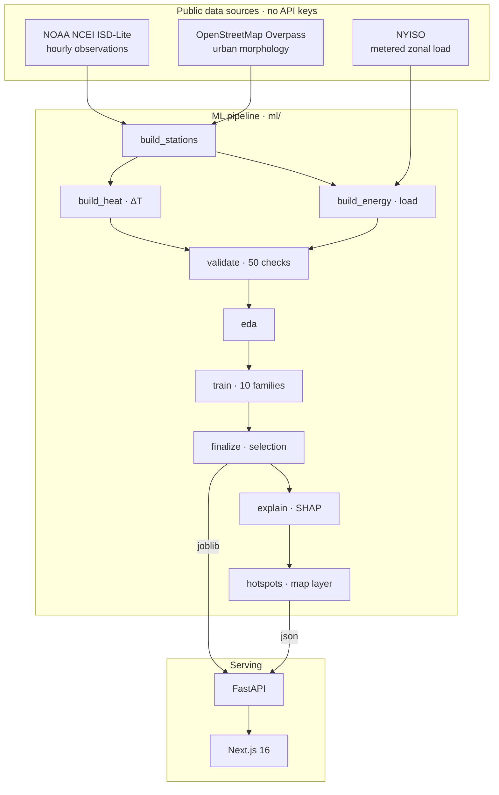
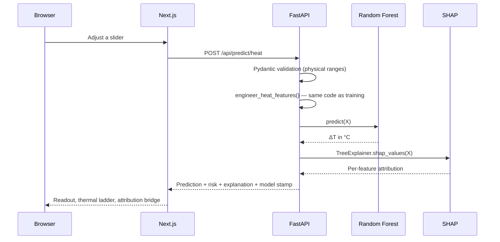

<div align="center">

# Urban Heat & Energy Intelligence Engine

**Predict urban heat risk · Forecast energy demand · Understand why · Explore what happens next**

<br/>

[](https://python.org)
[](https://nextjs.org)
[](https://fastapi.tiangolo.com)
[](https://scikit-learn.org)
[](https://typescriptlang.org)
[](https://docker.com)

<br/>

A city is measurably hotter than the land around it. UHEI learns that difference from **4.6 million hours** of weather-station observations and the physical fabric of each place — how much ground is built on, sealed, planted or flooded — then tells you which of those things the model leaned on to reach its answer.

Every number is computed from **public, unauthenticated data sources** by a reproducible pipeline. Nothing is mocked, synthesised, or hard-coded.

</div>

---

## What it does

| Capability | Description |
|---|---|
| **Predict** | Urban heat island intensity at any of 167 measured sites, under any atmospheric conditions inside the observed range |
| **Explain** | SHAP attribution for every prediction in degrees — which inputs pushed the number up, which pulled it down, by how much |
| **Map** | The whole station network scored under one shared atmosphere, so the differences on the map are the cities themselves |
| **Simulate** | The same fitted model rerun on modified inputs, with baseline and scenario side by side |

Seven interface surfaces: **Landing → Intelligence Dashboard → Prediction Studio → What-If Simulator → Hotspot Map → Model Lab → Methodology**

---

## Architecture



<details>
<summary>Request path</summary>



</details>

---

## Tech stack

| Layer | Technology |
|---|---|
| **ML** | Python 3.13 · pandas · NumPy · scikit-learn · SHAP · joblib |
| **Backend** | FastAPI · Pydantic v2 · Uvicorn |
| **Frontend** | Next.js 16 (App Router) · React 19 · TypeScript · Tailwind CSS v4 · Motion · Recharts · MapLibre GL · SWR |
| **Infra** | Docker · docker compose · GitHub Actions |

No database. No authentication. Neither would add functionality to a system whose job is to evaluate a model and explain the result.

---

## Data sources

| Source | Used for |
|---|---|
| [NOAA NCEI ISD-Lite](https://www.ncei.noaa.gov/products/land-based-station/integrated-surface-database) | Hourly temperature, dew point, pressure, wind, sky cover, precipitation from physical instruments |
| [NOAA ISD Station History](https://www.ncei.noaa.gov/pub/data/noaa/isd-history.csv) | Station identity, coordinates, elevation, period of record |
| [OpenStreetMap via Overpass](https://overpass-api.de/) | Building footprints, road network, green space, water bodies |
| [NYISO Public Market Data](http://mis.nyiso.com/public/) | Real-time metered load for 11 New York load zones |
| [Open-Meteo Elevation](https://open-meteo.com/en/docs/elevation-api) | Elevation cross-check (Copernicus DEM GLO-90) |

**No API keys required.** The pipeline is reproducible by anyone who clones the repository.

---

## Dataset

**Study domain:** US Northeast / Mid-Atlantic — NY, NJ, CT, MA, PA, RI, DE, MD, DC, NH, VT — calendar years 2022–2026.

> ISD-Lite is a quality-controlled archive with a 3–6 month processing lag. Effective data coverage runs through approximately August 2025. The pipeline automatically picks up new years as NOAA publishes them.

**The network:** 549 stations in domain → 210 with full period of record → 167 clear a 70% hourly-coverage gate.

**Chronological split — never shuffled:**

| Window | Period | Purpose |
|---|---|---|
| Train | 2022-01-01 → 2024-06-30 | 2.5 years, 2 full summers |
| Validation | 2024-07-01 → 2024-12-31 | Includes summer 2024 |
| **Test** | **2025-01-01 → 2025-08-27** | **Includes full summer 2025** |

---

## Features (35 total)

| Group | Features |
|---|---|
| **Background atmosphere** | `t_ref_c`, `rh_ref_pct`, `dewpoint_depression_c`, `wind_speed_ms`, `sky_cover_oktas`, `slp_hpa`, `precip_1h_mm`, `is_precipitating` |
| **Time & solar geometry** | `solar_elevation_deg`, `clear_sky_index`, `is_night`, `hour_sin/cos`, `doy_sin/cos`, `season`, `is_weekend` |
| **Geography** | `lat`, `lon`, `elevation_m` |
| **Urban morphology** | `building_plan_fraction_1km`, `building_count_km2_1km`, `road_length_km_km2_1km`, `green_fraction_1km`, `water_fraction_1km`, `impervious_fraction_1km`, `building_count_km2_3km`, `green_count_km2_3km`, `water_count_km2_3km` |
| **Interactions** | `impervious_x_calm`, `impervious_x_night`, `green_x_clearsky`, `building3k_x_calm`, `cloud_x_night`, `water_x_summer` |

The interactions encode the physics: the heat island peaks on calm, clear nights, and sealed surfaces matter after dark far more than at noon.

---

## Model results

Ten families, identical data, identical scoring:

| Model | Valid R² | Test R² | Test RMSE |
|---|---|---|---|
| Mean baseline | −0.000 | −0.004 | 2.006 |
| Linear Regression | 0.069 | 0.128 | 1.869 |
| Ridge / Lasso / ElasticNet | ~0.070 | ~0.127 | ~1.870 |
| Polynomial Ridge (deg 2) | 0.140 | 0.231 | 1.756 |
| Support Vector Regression | 0.127 | 0.239 | 1.747 |
| Decision Tree | 0.208 | 0.325 | 1.644 |
| Histogram Gradient Boosting | 0.329 | 0.421 | 1.523 |
| **Random Forest (tuned)** | **0.396** | **0.297** | **1.568** |

**An R² of 0.30 on hourly ΔT is a realistic number.** Station thermometers carry ±0.5 °C of measurement noise against a signal of a few degrees, and hourly anomalies are genuinely noisy. What matters is the structure — where, when, and driven by what.

**Per segment on the held-out test window:**

| Site class | Test R² | Test RMSE |
|---|---|---|
| Urban | 0.329 | 1.656 °C |
| Suburban | 0.291 | 1.592 °C |
| Rural | 0.193 | 1.443 °C |

The model is most accurate where the product is aimed. Rural sites are hardest — their anomaly is near zero by construction.

---

## Explainability

SHAP via `TreeExplainer` in two forms:

- **Global** — computed once on the test window. Mean |SHAP| per feature, summary point cloud, binned dependence plots. Served at `GET /api/shap`.
- **Local** — computed live per request. Base value + per-feature contributions in °C. The API asserts additivity: contributions must reconstruct the prediction.

> **Language discipline:** SHAP measures the model's internal attribution. Every string in the interface is phrased as association, not causation.

---

## API

Interactive docs at `/docs`.

| Method | Path | Purpose |
|---|---|---|
| `GET` | `/health` | Liveness + artifact status |
| `GET` | `/api/meta` | Project, dataset, split and model metadata |
| `GET` | `/api/models?task=` | Every candidate model with scores |
| `GET` | `/api/model-metrics?task=` | Selected model metrics and feature importance |
| `GET` | `/api/features?task=` | Feature catalogue with observed ranges |
| `GET` | `/api/validation` | Full validation and leakage report |
| `GET` | `/api/eda?task=` | Numbers behind every chart |
| `GET` | `/api/shap?task=` | Global SHAP structure |
| `GET` | `/api/sites` | The observation network (167 sites) |
| `GET` | `/api/zones` | NYISO load zones |
| `POST` | `/api/predict/heat` | Predict ΔT with SHAP attribution |
| `POST` | `/api/predict/energy` | Predict zonal demand with SHAP attribution |
| `POST` | `/api/simulate` | Baseline vs scenario (heat) |
| `POST` | `/api/hotspots` | Recompute map layer under supplied conditions |

---

## Local setup

**Prerequisites:** Python 3.11+ · Node.js 20+

```bash
git clone https://github.com/aryan45sandilya/Urban-Heat-Energy-Intelligence-Engine.git
cd Urban-Heat-Energy-Intelligence-Engine
cp .env.example .env
```

```bash
python -m venv .venv
.venv/Scripts/pip install -r requirements.txt   # Windows
# .venv/bin/pip install -r requirements.txt     # macOS / Linux
```

```bash
cd frontend && npm install
```

**Start the API:**
```bash
cd backend && python -m uvicorn app.main:app --reload --port 8000
```

**Start the frontend:**
```bash
cd frontend && npm run dev
```

Open [http://localhost:3000](http://localhost:3000).

---

## Running the ML pipeline

> The trained models are already committed. Only run the pipeline if you want to retrain from scratch.

```bash
# Full pipeline (takes several hours on first run — downloads ~370 Overpass queries)
python -m uhei.pipeline

# Train only (uses cached datasets)
python -m uhei.pipeline --stage train finalize explain hotspots

# Force re-download everything
python -m uhei.pipeline --force
```

| Flag | Effect |
|---|---|
| `--stage ...` | Run only named stages: `network datasets validate eda train finalize explain hotspots` |
| `--force` | Ignore caches and re-download from source APIs |
| `--rf-iter N` | Hyperparameter search iterations (default 24) |
| `--skip-energy` | Build and train the heat task only |

---

## Docker

```bash
docker compose up --build
```

Web on `:3000`, API on `:8000`. Artifacts are **mounted not baked** (`./ml/models` and `./ml/reports`, read-only) — a retrain never requires an image rebuild.

---

## Deployment

| Service | Platform |
|---|---|
| Frontend (Next.js) | Vercel — connect the repo, set root to `frontend` |
| Backend (FastAPI + models) | Railway — set start command to `uvicorn app.main:app --host 0.0.0.0 --port $PORT` from `backend/` |

**Environment variables:**

```bash
# Railway (backend)
UHEI_CORS_ORIGINS=https://your-app.vercel.app,http://localhost:3000
UHEI_ENVIRONMENT=production

# Vercel (frontend)
NEXT_PUBLIC_API_BASE_URL=https://your-backend.up.railway.app
```

**Sizing:** The API holds both models in memory — budget ~500 MB RAM. Predictions are single-digit milliseconds; SHAP explanations are tens of milliseconds.

---

## Validation & leakage audit

`ml/src/uhei/validate.py` runs **50 checks** and writes `ml/reports/data_validation.json`.

| Check | Result |
|---|---|
| Target used as a feature | ✗ absent |
| Target component `t_site_c` as feature | ✗ absent |
| Any feature correlating > 0.98 with target | ✗ none |
| Train / valid / test row overlap | ✗ none |
| Splits strictly time-ordered | ✓ verified |
| Preprocessing fitted outside training folds | ✗ none |
| Rolling weather aggregates looking forward | ✗ backward-only |
| Station used as its own reference | ✗ prevented by 15 km minimum |

---

## Limitations

1. **Airports, not city centres.** Quality hourly observations come mostly from aerodromes on the urban periphery. Hottest street canyons are under-represented; measured anomalies are conservative.
2. **OSM is uneven.** Buildings are near-complete in this region; green space and road width are less consistent.
3. **Cloud cover is sparse** — ~60% reporting on a physically important variable.
4. **One region.** Applying this to a desert or tropical city is extrapolation.
5. **Association, not causation.** Every number describes a statistical relationship learned from observations.
6. **No uncertainty quantification.** A single point estimate, not an interval.

---

## Future work

- **Prediction intervals** — quantile forests or conformal prediction
- **Denser observations** — mesonet / citizen-science networks to reach street canyons
- **Satellite LST** — Landsat 8/9 and MODIS for spatially continuous coverage
- **Sky view factor & building height** — strongest morphological predictors in the literature
- **Wider geography** — the pipeline is parameterised by state list and bounding box; extending it is configuration, not code
- **Causal framing** — matched-pairs design to say something about interventions, not just associations

---

<div align="center">

Built with [NOAA NCEI](https://ncei.noaa.gov) · [OpenStreetMap](https://openstreetmap.org) · [NYISO](https://nyiso.com)

</div>
