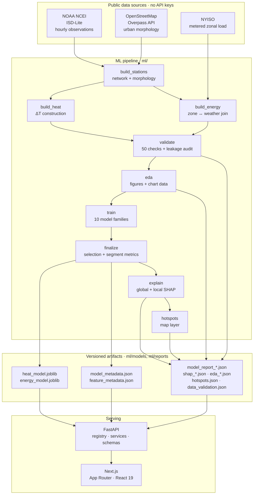
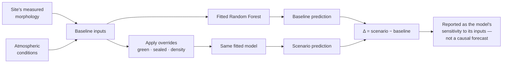
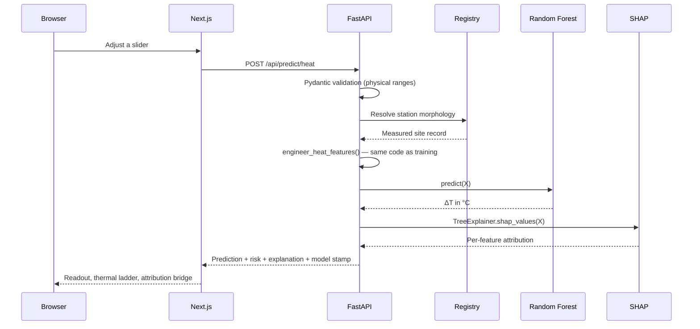

# Urban Heat & Energy Intelligence Engine

**Predict urban heat risk. Forecast energy demand. Understand why. Explore what happens next.**

A city is measurably hotter than the land around it. UHEI learns that difference
from three years of hourly weather-station observations and the physical fabric
of each place — how much ground is built on, sealed, planted or flooded — then
tells you which of those things the model leaned on to reach its answer.

Every number in this repository and in the interface is computed from public,
unauthenticated data sources by the pipeline in `ml/`. Nothing is mocked,
synthesised, or hard-coded.

---

## Contents

1. [The problem](#1-the-problem)
2. [Why it matters](#2-why-it-matters)
3. [What was built](#3-what-was-built)
4. [Architecture](#4-architecture)
5. [Tech stack](#5-tech-stack)
6. [Data sources](#6-data-sources)
7. [Dataset construction](#7-dataset-construction)
8. [Feature engineering](#8-feature-engineering)
9. [Validation & leakage auditing](#9-validation--leakage-auditing)
10. [Models & results](#10-models--results)
11. [Random Forest](#11-random-forest)
12. [Explainability](#12-explainability)
13. [What-if simulation](#13-what-if-simulation)
14. [Geospatial layer](#14-geospatial-layer)
15. [API](#15-api)
16. [Setup](#16-setup)
17. [Running the pipeline](#17-running-the-pipeline)
18. [Local development](#18-local-development)
19. [Testing](#19-testing)
20. [Docker](#20-docker)
21. [Deployment](#21-deployment)
22. [Design system](#22-design-system)
23. [Model card](#23-model-card)
24. [Limitations](#24-limitations)
25. [Future work](#25-future-work)

---

## 1. The problem

Built-up land stores solar energy in masonry and asphalt during the day and
releases it after sunset, while dry sealed surfaces remove the evaporative
cooling that vegetation provides. The result is the **urban heat island**: a
measurable temperature difference between a city and the countryside around it,
strongest on calm, clear nights.

UHEI models that difference directly:

> **Target — `uhi_intensity_c`:** the hourly air-temperature anomaly of a site
> relative to the rural landscape around it, in °C.
>
> ```
> ΔT(s, t) = T_obs(s, t) − mean_r [ T_obs(r, t) − Γ · (z_s − z_r) ]
> ```
>
> where `r` runs over the three nearest qualifying **rural reference stations**
> and `Γ = 6.5 °C/km` is the standard environmental lapse rate, applied so a hill
> station is not credited with a cool "anomaly" that is really just altitude.

A second model predicts **zonal electricity demand** (`load_mw`) for the eleven
New York ISO load zones from weather and calendar conditions, because the upper
arm of the demand-temperature curve is where urban heat and the grid meet.

### Why ΔT rather than raw temperature

Raw air temperature is dominated by the synoptic weather pattern, which is
identical for a city and its countryside. A model of raw temperature learns the
season, scores an impressive R², and says nothing whatsoever about cities.
Differencing against the rural background removes the synoptic signal, and what
remains is the quantity a planner actually asks about.

The construction validates itself. Averaged over three years of summer nights:

| Site class | Mean ΔT | Stations |
|---|---|---|
| Rural | **−0.01 °C** | 46 |
| Suburban | **+0.38 °C** | 110 |
| Urban | **+0.98 °C** | 29 |

Rural sites sit at zero — that is the control, and it says the reference
construction is unbiased. The urban heat island emerges from the data without
the pipeline ever being told it exists.

---

## 2. Why it matters

Heat is the deadliest weather hazard in most temperate countries, and the
mortality is concentrated in exactly the dense, sealed, treeless neighbourhoods
this model scores highest. At the same time, those neighbourhoods drive the
air-conditioning load that stresses the grid on the hottest evenings. A tool
that can say *where* the anomaly concentrates, *why* the model thinks so, and
*what changes when the ground changes* is a tool for a conversation that usually
happens without evidence.

---

## 3. What was built

Four capabilities, everything else supports them.

| | |
|---|---|
| **Predict** | Urban heat island intensity at any of the measured sites, under any atmospheric conditions inside the observed range. |
| **Explain** | SHAP attribution for every prediction, in degrees: which inputs pushed the number up, which pulled it down, by how much. |
| **Map** | The whole station network scored under one shared atmosphere, so the differences on the map are the cities themselves. |
| **Simulate** | The same fitted model rerun on modified inputs, with baseline and scenario side by side. |

Seven interface surfaces: Landing, Intelligence Dashboard, Prediction Studio,
What-If Simulator, Hotspot Map, Model Lab, Methodology.

---

## 4. Architecture

### System



### Data pipeline

```mermaid
flowchart LR
    A["ISD inventory<br/>549 stations in domain"] --> B["Period-of-record filter<br/>210 candidates"]
    B --> C["ISD-Lite download<br/>630 station-years"]
    C --> D["Parse + physical gates<br/>4.75M observations"]
    D --> E["Coverage gate ≥ 70%<br/>185 stations"]
    E --> F["Overpass morphology<br/>20 m areal sampling"]
    F --> G["Urban / rural classification<br/>from observed terciles"]
    G --> H["Reference pairing<br/>3 nearest rural, 15–150 km"]
    H --> I["Lapse correction<br/>Γ = 6.5 °C/km"]
    I --> J["ΔT = T_site − T_ref<br/>4.16M site-hours"]
    J --> K["Chronological split<br/>train / valid / test"]
```



### What-if simulation



### Request path



---

## 5. Tech stack

**ML** — Python 3.13, pandas, NumPy, scikit-learn, SHAP, joblib, matplotlib
**Backend** — FastAPI, Pydantic v2, Uvicorn
**Frontend** — Next.js 16 (App Router), React 19, TypeScript, Tailwind CSS v4,
Motion, Recharts, MapLibre GL, SWR, Lucide
**Infrastructure** — Docker, docker compose, GitHub Actions

No database. No authentication. Neither would add functionality to a system
whose job is to evaluate a model and explain the result, and both would have
turned a prediction engine into a CRUD application.

---

## 6. Data sources

| Source | Used for | Licence |
|---|---|---|
| [NOAA NCEI ISD-Lite](https://www.ncei.noaa.gov/products/land-based-station/integrated-surface-database) | Hourly air temperature, dew point, pressure, wind, sky cover, precipitation from physical instruments | US Government work — public domain |
| [NOAA NCEI ISD station history](https://www.ncei.noaa.gov/pub/data/noaa/isd-history.csv) | Station identity, coordinates, elevation, period of record | US Government work — public domain |
| [OpenStreetMap via Overpass](https://overpass-api.de/) | Building footprints, road network, green space, water bodies | ODbL 1.0 — © OpenStreetMap contributors |
| [NYISO public market data](http://mis.nyiso.com/public/) | Real-time metered load for 11 New York load zones | NYISO public market information |
| [Open-Meteo Elevation](https://open-meteo.com/en/docs/elevation-api) | Elevation cross-check (Copernicus DEM GLO-90) | CC-BY 4.0 |

**No API keys are required.** Every source is public and unauthenticated, which
is deliberate: the pipeline is reproducible by anyone who clones the repository.

### Known source limitations

- **ISD-Lite sky cover is sparse** — roughly 60% of hours report it. Missing
  values are imputed by the pipeline's own imputer, fitted on training folds.
- **OSM ways only** — multipolygon relations are not decomposed, so green cover
  is a slight under-estimate where a park is mapped as a relation.
- **Road width is not tagged**, so the impervious figure assumes a 7 m
  carriageway. That is a stated assumption, not a measurement.
- **Airports dominate the hourly network.** Genuine urban-core stations exist in
  it (Central Park, downtown Baltimore, the Wall Street heliport) but are the
  exception, so measured anomalies here are conservative.

---

## 7. Dataset construction

### Study domain

US Northeast and Mid-Atlantic — NY, NJ, CT, MA, PA, RI, DE, MD, DC, NH, VT —
for calendar years **2022, 2023, 2024**. Restricting to one broad climate region
keeps the urban-versus-rural comparison meaningful: similar synoptic forcing,
similar continental climate, rather than mixing deserts with coastal temperate.

### The network

549 stations sit inside the bounding box; 210 have a period of record spanning
the whole window; 185 clear a 70% hourly-coverage gate. Those 185 are the
network.

### Urban morphology, measured not assumed

For each station, Overpass returns every building, road, green polygon and water
body within 1 km, plus feature counts within 3 km. Surface cover is then measured
by **areal sampling on a 20 m lattice** inside the disc:

```python
cover["green"] &= ~cover["building"]     # a roof is not a green surface
green_fraction = cover["green"].mean()
```

Sampling rather than summing polygon areas matters. Summing would count a park
or lake whose polygon extends beyond the sampling radius *in full* — Central Park
alone would saturate a 1 km disc, which is exactly the bug an early version had —
and would double-count overlapping polygons. With sampling, every point counts
once and only the part of a feature actually inside the radius is measured.

Classification into urban / suburban / rural comes from the **observed terciles**
of 3 km building density, clamped by absolute floors so a domain that happens to
contain no real city cannot manufacture one.

### Reference pairing

Every station is a *site*, including rural ones. Each site's references are the
three nearest **rural** stations satisfying all of:

- at least 15 km away (a reference must not be "the same place")
- no more than 150 km away
- within 300 m of the site's elevation
- 1 km water fraction ≤ 0.35, and at least some mapped road within 1 km

That last pair is a land mask. A lighthouse in Delaware Bay is thermally
governed by the sea, not by the countryside; it remains a valid *site*, but it
cannot be a yardstick.

Rural sites get references too — other rural stations — which is what produces
the −0.01 °C control.

### Energy dataset

NYISO publishes 5-minute metered load per zone as free monthly ZIP archives.
Timestamps carry an explicit `Time Zone` column (EST/EDT), so DST transitions are
resolved from the data rather than guessed. Load is averaged to the hour and an
hour is kept only when at least 8 of its 12 intervals reported. Each zone is
represented by the three nearest ISD stations within 90 km.

**Result: 4,158,374 site-hours across 166 sites, and 289,082 zone-hours across
11 zones.**

---

## 8. Feature engineering

`ml/src/uhei/features.py` is imported by the training pipeline **and** by the
serving layer, so a prediction made through the API is transformed by exactly the
same code that produced the training matrix. Every function in it is pure.

| Group | Features |
|---|---|
| **Background atmosphere** | `t_ref_c`, `rh_ref_pct`, `dewpoint_depression_c`, `wind_speed_ms`, `sky_cover_oktas`, `slp_hpa`, `precip_1h_mm`, `is_precipitating` |
| **Time & solar geometry** | `solar_elevation_deg`, `clear_sky_index`, `is_night`, `hour_sin/cos`, `doy_sin/cos`, `season`, `is_weekend` |
| **Geography** | `lat`, `lon`, `elevation_m` |
| **Urban morphology** | `building_plan_fraction_1km`, `building_count_km2_1km`, `road_length_km_km2_1km`, `green_fraction_1km`, `water_fraction_1km`, `impervious_fraction_1km`, `building_count_km2_3km`, `green_count_km2_3km`, `water_count_km2_3km` |
| **Interactions** | `impervious_x_calm`, `impervious_x_night`, `green_x_clearsky`, `building3k_x_calm`, `cloud_x_night`, `water_x_summer` |

Solar elevation is computed from the Spencer (1971) declination and
equation-of-time series — deterministic astronomy, not an estimate. The
interactions encode the physics the literature reports: the heat island peaks on
calm, clear nights, and sealed surfaces matter after dark far more than at noon.

**No fitted statistic lives in this module.** An earlier version filled missing
wind and cloud from the batch median, which meant training features absorbed a
statistic computed partly from the test window, and a single-row API request took
the median of itself. Missing values are now propagated as NaN and handled by the
`SimpleImputer` inside the pipeline, which is fitted on training folds only.
`ml/tests/test_features.py` asserts single-row and batch transformations agree
element-for-element, which is the test that would have caught it.

---

## 9. Validation & leakage auditing

`ml/src/uhei/validate.py` runs **50 checks** across both datasets and writes
`ml/reports/data_validation.json`, surfaced in the product's Methodology page.
Hard failures raise, so a bad dataset cannot reach training silently.

- **Schema & types** — every critical column present and non-null
- **Duplicates** — none on `(station_id, ts_utc)` or `(zone, ts_utc)`
- **Physical ranges** — 14 variables gated against instrument-fault bounds
- **Timestamps** — timezone-aware, hour-aligned, contiguous span
- **Geography** — every row inside the study bounding box
- **Distributions** — target moments and 3×IQR tail counts reported (and retained; real weather is heavy-tailed)

### Leakage checks, specifically

| Check | Result |
|---|---|
| Target used as a feature | ✗ absent |
| Target *components* used as features (`t_site_c`) | ✗ absent — this is the one that matters, since ΔT = T_site − T_ref |
| Any feature correlating > 0.98 with the target | ✗ none |
| Train / validation / test row overlap | ✗ none |
| Splits strictly time-ordered | ✓ verified |
| Preprocessing fitted outside training folds | ✗ none — imputation and scaling live inside the pipeline |
| Autoregressive load term in the demand model | ✗ none |
| Rolling weather aggregates looking forward | ✗ backward-only, verified by recomputation in tests |
| A station used as its own reference | ✗ prevented by a 15 km minimum |

### Splitting

Chronological, never shuffled:

| Window | Period |
|---|---|
| Train | 2022-01-01 → 2024-02-29 |
| Validation | 2024-03-01 → 2024-07-31 |
| Test | 2024-08-01 → 2024-12-31 |

Both evaluation windows contain a full summer on purpose. Evaluating a heat model
only on shoulder seasons would flatter it in exactly the regime that matters
least. Cross-validation inside the training window uses `TimeSeriesSplit`.

Windows larger than their cap are thinned by a **regular stride through time**,
which preserves diurnal and seasonal structure and the station mix exactly. Every
model is scored on identical rows.

---

## 10. Models & results

Ten families, identical data, identical scoring. Numbers below come from
`ml/reports/model_report_heat.json`; re-running the pipeline regenerates them.

### Urban heat island — held-out test window

| Model | Valid R² | Valid RMSE | Test R² | Test RMSE | Test MAE | CV RMSE |
|---|---|---|---|---|---|---|
| Mean baseline | −0.000 | 1.856 | −0.004 | 2.006 | 1.458 | 1.861 ± 0.061 |
| Linear Regression | 0.069 | 1.791 | 0.128 | 1.869 | 1.385 | 1.772 ± 0.067 |
| Ridge Regression | 0.069 | 1.791 | 0.128 | 1.869 | 1.385 | 1.772 ± 0.067 |
| Lasso Regression | 0.071 | 1.789 | 0.125 | 1.872 | 1.383 | 1.776 ± 0.072 |
| ElasticNet | 0.071 | 1.789 | 0.127 | 1.870 | 1.383 | 1.773 ± 0.069 |
| Polynomial Ridge (deg 2) | 0.140 | 1.721 | 0.231 | 1.756 | 1.316 | 2.467 ± 1.317 |
| Support Vector Regression (RBF) | 0.127 | 1.734 | 0.239 | 1.747 | 1.312 | 1.808 ± 0.125 |
| Decision Tree | 0.208 | 1.651 | 0.325 | 1.644 | 1.223 | 1.777 ± 0.131 |
| **Random Forest** | **0.333** | **1.516** | **0.432** | **1.509** | **1.117** | **1.599 ± 0.109** |
| Histogram Gradient Boosting | 0.329 | 1.521 | 0.421 | 1.523 | 1.131 | 1.610 ± 0.132 |

The **shipped** forest — after the size-constrained selection described below —
scores **test R² 0.427, RMSE 1.515 °C** in a **53 MB** artifact.

The progression is the argument. Linear models capture 7% of the variance; adding
smooth curvature gets to 14%; a single tree reaches 21%; bagging trees reaches
33%. The heat island is a product of *interactions* — sealed ground matters at
night and barely at noon, and only when the wind is light — and that is precisely
the structure a forest represents natively and a linear model cannot.

Polynomial Ridge and SVR were fitted on strided subsamples (their cost grows
faster than linearly in the number of samples) and are labelled as such
everywhere they appear. They were scored on the same held-out rows as everything
else.

**An R² of 0.43 on hourly ΔT is a realistic number, not a disappointing one.**
Station thermometers carry roughly ±0.5 °C of measurement noise against a signal
of a few degrees, and hourly anomalies are genuinely noisy. What the product is
for is the structure — where, when, and driven by what — which the segment and
regime breakdowns in the Model Lab report honestly.

### Electricity demand

The demand model reaches a very high overall R², and the Model Lab says plainly
why that number flatters it: zonal load ranges from ~300 MW in Millwood to
~5,600 MW in New York City, so *any* model that knows which zone it is looking at
scores well. **Within-zone R² is the honest figure**, and it is reported
per-zone in the interface and in `segment_metrics`.

---

## 11. Random Forest

The Model Lab explains the mechanism in the product itself; in brief:

- **A tree splits, and then overfits.** Grown deep enough, a single CART tree
  fits training rows almost perfectly — it has memorised noise. The single tree
  in the comparison shows exactly that gap.
- **Bootstrap sampling decorrelates the errors.** Each tree sees a different
  resample, so the trees make different mistakes and averaging cancels variance
  while leaving shared signal intact.
- **Feature randomness stops one input dominating.** Without a random feature
  subset at each split, background temperature and the night flag would head
  every tree and morphology would rarely get a look in.
- **Bias/variance.** The forest trades a little bias for a large reduction in
  variance; the train-minus-validation gap reported in the Model Lab is the
  honest measure of what remains.

### Tuning

`RandomizedSearchCV`, 18 configurations × 3 `TimeSeriesSplit` folds, on a strided
subsample of the **training window only**:

| Hyperparameter | Search space |
|---|---|
| `n_estimators` | 200, 300, 400 |
| `max_depth` | None, 14, 20, 28, 36 |
| `min_samples_split` | 2, 5, 10, 20 |
| `min_samples_leaf` | 1, 2, 4, 8 |
| `max_features` | 0.3, 0.5, 0.7, sqrt, 1.0 |
| `bootstrap` | True, False |

The test set is never involved.

### Final selection under a size budget

Search optimises cross-validated RMSE inside the training window. It is blind to
a practical constraint: the search-optimal configuration — 400 trees with a leaf
floor of 4 — **serialises to 417 MB and took the API 3 m 48 s to load at
start-up**. That is not a deployable model, and on a machine with 8 GB of RAM it
is not even a fittable one.

So `ml/src/uhei/finalize.py` costs each configuration *before* fitting it. The
estimator is calibrated against measurement rather than assumed — the naive
"a tree splits until leaves hold `min_samples_leaf` rows" argument over-predicts
by a factor of two, because CART stops well short of that bound in most branches:

```python
predicted_mb = n_train / min_samples_leaf * n_estimators * 64 / 1024**2
```

Configurations over the 200 MB budget are reported, not fitted; finding out
empirically that a forest is too big to deploy means first allocating it.
The rest are refitted on the full training window, scored on the validation
window, and:

> Among configurations whose validation RMSE is within **1%** of the best, ship
> the **smallest artifact**.

The candidate set is deliberately three forests of *equal predicted size but
different shape*, so the report says something about where the capacity is best
spent rather than only how much of it there is:

| Candidate | Leaf floor | Trees | Valid RMSE | Valid R² | Measured size |
|---|---|---|---|---|---|
| `tuned` (search-optimal) | 4 | 400 | *not fitted* | — | 1086 MB predicted |
| `tuned-constrained` | 32 | 400 | 1.5646 | 0.289 | 127 MB |
| `compact` | 24 | 300 | 1.5259 | 0.324 | 132 MB |
| **`lean` — shipped** | **16** | **200** | **1.5163** | **0.332** | **131 MB** |

At essentially identical artifact size, **fewer and deeper beats more and
shallower.** And `lean` at 1.5163 matches the unconstrained default forest's
1.5159 — so the size constraint cost, in the end, nothing measurable. The shipped
artifact is **53 MB on disk**, an eight-fold reduction, and the API loads it in
seconds rather than minutes.

Every candidate's score *and* size is recorded in `selection.candidates` and
displayed in the Model Lab. The test window plays no part in the decision.

### Where the model is actually informative

A single R² hides this, so `finalize` reports it per segment on the held-out
window:

| Site class | Test R² | Test RMSE |
|---|---|---|
| **Urban** | **0.475** | 1.527 °C |
| Suburban | 0.416 | 1.552 °C |
| Rural | 0.283 | 1.414 °C |

The model is most accurate precisely where the product is aimed. Rural sites are
hardest, which is expected: their anomaly is near zero by construction, so there
is less signal to explain.

---

## 12. Explainability

SHAP, via `TreeExplainer`, in two forms.

**Global** — computed once at training time on a sample of the **test** window:
mean |SHAP| per feature, a summary point cloud, and binned dependence of SHAP on
feature value. Served at `GET /api/shap`.

**Local** — computed live per request by `LocalExplainer`, returning the base
value, per-feature contributions in target units, and the residual of everything
not in the top-k. The API test asserts **additivity**: base value plus all
contributions must reconstruct the prediction.

### Language discipline

SHAP measures the model's internal attribution. It says how the output changes as
an input changes, *given the rest of the input*. It does not establish that
changing the world would change the temperature. Every string the system produces
is phrased accordingly:

> ✅ "The model associates higher impervious fraction with a larger predicted anomaly."
> ❌ "Sealed ground causes temperatures to rise."

---

## 13. What-if simulation

The simulator evaluates the same fitted model twice — once on baseline inputs,
once on modified inputs — and reports the difference, alongside an itemised list
of exactly which variables changed and the SHAP attribution for both runs.

Adjustable levers are the site's measured morphology: green cover, sealed
surface, building footprint, neighbourhood density, road density, water cover;
plus the full atmospheric state. Slider bounds come from the **p01–p99 range
observed in the training window**, so the interface cannot offer a control the
model was not trained to handle.

Results are labelled **"Model-based scenario simulation"** throughout, with the
method statement attached to every response:

> The fitted model is evaluated on baseline and modified inputs. The difference
> describes the model's response to that change in inputs, not a prediction of
> what would happen if the city were rebuilt.

A percentage change is omitted rather than shown when the baseline anomaly is
near zero, because a percentage of ~0 is a misleading three-digit number.

---

## 14. Geospatial layer

166 real coordinates, each carrying its own measured morphology. Nothing is
interpolated into places where no observation exists.

- **Observed layers** — what the instruments recorded (mean and 90th-percentile
  summer-night ΔT, mean temperature).
- **Modelled layers** — the tuned forest's prediction for every site **with the
  atmosphere held identical everywhere**. That is the point: holding weather
  constant isolates the part of the anomaly attributable to the built fabric,
  which is exactly the planner's question.
- **Morphology layers** — building density, green cover, sealed surface.

MapLibre GL with a neutral raster basemap, restyled to the project palette;
custom legend, controls, and site panel.

---

## 15. API

Interactive documentation at `/docs`.

| Method | Path | Purpose |
|---|---|---|
| `GET` | `/health` | Liveness plus artifact status and any load problems |
| `GET` | `/api/meta` | Project, dataset, split and model metadata |
| `GET` | `/api/models?task=` | Every candidate model with its scores |
| `GET` | `/api/model-metrics?task=` | Selected model's metrics and feature importance |
| `GET` | `/api/features?task=` | Feature catalogue with observed ranges and defaults |
| `GET` | `/api/validation` | Full validation and leakage report |
| `GET` | `/api/eda?task=` | The numbers behind every chart |
| `GET` | `/api/shap?task=` | Global SHAP structure |
| `GET` | `/api/sites` | The observation network |
| `GET` | `/api/zones` | NYISO load zones |
| `POST` | `/api/predict/heat` | Predict ΔT, with SHAP attribution |
| `POST` | `/api/predict/energy` | Predict zonal demand, with SHAP attribution |
| `POST` | `/api/simulate` | Baseline versus scenarios (heat) |
| `POST` | `/api/simulate/energy` | Baseline versus scenarios (demand) |
| `GET` | `/api/hotspots` | Pre-computed map layer for a reference summer night |
| `POST` | `/api/hotspots` | Recompute the layer under supplied conditions |

### Engineering

- **Pydantic v2** validation with physical bounds — dew point above air
  temperature is rejected, as is 120 °C or negative wind.
- **Structured errors** with a stable shape and a `request_id`; stack traces stay
  in the server log and never reach the network.
- **Correct status codes** — 404 for an unknown station, 422 for invalid input,
  **503 with an explicit message when an artifact is missing**. The service never
  substitutes a plausible number for a model it does not have.
- Request ID and response-time headers on every response; CORS restricted to
  configured origins; no secrets anywhere.

---

## 16. Setup

**Prerequisites:** Python 3.11+ (3.13 recommended), Node.js 20+ (22 recommended).

```bash
git clone <repository-url>
cd uhei
cp .env.example .env
```

```bash
python -m venv .venv && .venv/bin/pip install -r requirements.txt && .venv/bin/pip install -e . --no-deps
```

On Windows use `.venv\Scripts\` in place of `.venv/bin/`.

```bash
cd frontend && npm install
```

---

## 17. Running the pipeline

```bash
python -m uhei.pipeline
```

Stages run in order and each is idempotent — raw downloads, parsed frames and
built datasets are cached on disk, so a re-run costs only what changed.

```bash
python -m uhei.pipeline --stage train finalize explain hotspots
```

```bash
python -m uhei.pipeline --force
```

| Flag | Effect |
|---|---|
| `--stage ...` | Run only the named stages (`network`, `datasets`, `validate`, `eda`, `train`, `finalize`, `explain`, `hotspots`) |
| `--force` | Ignore caches and re-download from the source APIs |
| `--rf-iter N` | Hyperparameter search iterations (default 24) |
| `--skip-energy` | Build and train the urban-heat task only |

**A cold first run takes several hours**, dominated by ~370 Overpass queries and
the model comparison. Downloads are polite: requests are spread across three
Overpass mirrors with a courtesy delay, retries, and a descriptive user agent.
Please put a real contact address in `UHEI_USER_AGENT` before a large rebuild.

---

## 18. Local development

```bash
cd backend && python -m uvicorn app.main:app --reload --port 8000
```

```bash
cd frontend && npm run dev
```

The web client reads `NEXT_PUBLIC_API_BASE_URL` (default
`http://127.0.0.1:8000`). Because Next inlines `NEXT_PUBLIC_*` at build time, it
must be set before `npm run build`, not at runtime.

Without artifacts the API starts anyway, logs exactly which ones are missing, and
returns 503 from the endpoints that need them.

---

## 19. Testing

```bash
pytest
```

```bash
cd frontend && npx tsc --noEmit && npm run lint && npm run build
```

**ML tests** — physical and geometric helpers checked against independently
verifiable values (published NWS heat-index entries, known great-circle
distances, solar elevation at solstice); feature-engineering determinism,
immutability, and **single-row/batch equivalence**; leakage and split integrity
against the real processed datasets.

**API tests** — response shapes, validation rejection, SHAP additivity,
determinism, physical expectations (wind suppresses the anomaly; hotter weather
raises summer demand), scenario delta consistency, and the degraded-mode contract.

Tests that need built artifacts skip themselves with a clear message, so CI
passes on a fresh clone while still asserting the degraded-mode behaviour.

---

## 20. Docker

```bash
docker compose up --build
```

Web on `:3000`, API on `:8000`.

Artifacts are **mounted, not baked in** (`./ml/models` and `./ml/reports`,
read-only). A retrain therefore does not require an image rebuild, and an image
can never ship a stale model by accident. Both images run as non-root with
health checks; the web image is a multi-stage build on Next's standalone output.

---

## 21. Deployment

The system is two stateless services and a directory of artifacts, so it
deploys onto anything that runs containers.

**Checklist**

- [ ] `python -m uhei.pipeline` has produced `ml/models/` and `ml/reports/`
- [ ] `UHEI_CORS_ORIGINS` lists the real web origin
- [ ] `NEXT_PUBLIC_API_BASE_URL` set **before** the frontend build
- [ ] Artifact volume mounted read-only at `/app/ml/models` and `/app/ml/reports`
- [ ] `/health` returns `ready: true` with an empty `problems` array
- [ ] `UHEI_ENVIRONMENT=production`

**Sizing.** The API holds both models in memory; budget ~1 GB with the
size-constrained artifacts. Prediction is single-digit milliseconds; a SHAP
explanation is tens of milliseconds. Start with one worker and scale out —
the process is read-only and shares nothing, so it scales horizontally without
coordination.

CI (`.github/workflows/ci.yml`) installs, tests, lints, type-checks, builds the
frontend and builds both images.

---

## 22. Design system

The interface is built to look like an instrument for urban climate work, not
like a dashboard template.

**Palette** — fired terracotta for heat, oxidised copper for energy, lichen green
for vegetation and cooling, slate mineral for water and the grid, on warm paper
or deep charcoal. A seven-stop thermal ramp is shared by the map, the legend, the
charts and the logo, so one colour means one thing everywhere. No purple, no
gradient meshes, no glass, no glow.

**Typography** — Archivo for headlines, Public Sans for running text and
controls, IBM Plex Mono for every measured value so numbers align in columns.
Large readouts use tabular figures and tight negative tracking.

**Layout** — grid-first and rule-based. Blocks are separated by hairlines rather
than stacked as rounded cards; cards appear only where grouping genuinely aids
comprehension. Radii are 2–5 px.

**Signature elements** — three, used consistently:

1. **Thermal ladder** — a surveyor's scale with discrete rungs and tick marks
   placing a prediction among everything the network has measured.
2. **Morphology fingerprint** — five hairline bars describing a site's physical
   fabric, recognisable at a glance on cards, map popups and prediction headers.
3. **Attribution bridge** — SHAP as a span between the model's average output and
   this prediction, one girder per input, drawn to scale.

**Motion** — Motion (Framer Motion) used for entrance, state transition, data
reveal and feedback only. No decorative loops, no parallax, no particles.
`prefers-reduced-motion` is honoured throughout.

**Responsive** — verified from 320 px to 4K. Mobile reorders and collapses rather
than shrinking: a full-screen navigation sheet, stacked analytical blocks,
touch-sized controls, horizontally scrollable tables inside their own containers.
Large screens get `max-width` containers and expanded visualisation areas rather
than stretched text.

**Accessibility** — semantic landmarks, skip link, visible focus rings, labelled
controls, `aria-live` on asynchronous results, keyboard-reachable map points,
and contrast held above WCAG AA in both themes.

---

## 23. Model card

### Urban heat island model

| | |
|---|---|
| **Purpose** | Estimate how much hotter a measured location is than the rural landscape around it, hour by hour. |
| **Intended use** | Exploratory analysis, planning conversations, teaching. |
| **Out of scope** | Emergency response, regulatory decisions, individual health guidance. |
| **Target** | `uhi_intensity_c` (°C) |
| **Features** | 35, across atmosphere, solar geometry, time, geography, morphology, interactions |
| **Training data** | 4.16M site-hours, 166 sites, US Northeast/Mid-Atlantic, 2022–2024 |
| **Model** | Random Forest, tuned by TimeSeriesSplit CV, selected on validation under a size budget |
| **Evaluation** | Chronological held-out window (Aug–Dec 2024), scored once |

**Known failure modes**

- Extrapolates silently. Asked about a sealed fraction higher than anything it
  has seen, it returns the value at the edge of its training range with no warning.
- No calibrated uncertainty — a single number, not an interval.
- Least informative at midday in high wind, when the anomaly is near zero anyway.
- Leans on an imputed value where a station's cloud channel is silent.
- Not a physical model. It has learned an association between conditions and
  measured temperature differences, and nothing more.

### Electricity demand model

| | |
|---|---|
| **Purpose** | Estimate zonal electricity demand from weather and calendar conditions. |
| **Intended use** | Understanding how demand responds to weather. |
| **Out of scope** | Dispatch, trading, reliability planning. |
| **Target** | `load_mw` (MW) |
| **Training data** | 289,082 zone-hours, 11 NYISO zones, 2022–2024 |

**Known failure modes**

- Overall R² is dominated by differences *between* zones; within-zone skill is
  the honest figure and is reported separately.
- No autoregressive load term, so it cannot track a demand ramp in progress.
- Blind to outages, price response, demand-side programmes and generation mix.
- Zone weather is a three-station average standing in for an entire service area.

### Responsible use

Report predictions as predictions. State the conditions they assume. Do not
present a scenario difference as the expected result of an intervention — it is
the model's sensitivity to a change in its inputs, which is a narrower and weaker
claim. Where a decision would affect people's safety, treat this as a source of
questions, not answers.

---

## 24. Limitations

Consolidated, and repeated inside the product itself:

1. **Airports are not city centres.** Hourly observations of this quality come
   mostly from aerodromes on the edge of the places they serve. The hottest
   street canyons are under-represented, so measured anomalies are conservative.
2. **OpenStreetMap is uneven.** Buildings are near-complete in this region; green
   space and water are tagged less consistently, only ways are measured, and road
   width is assumed.
3. **Cloud cover is sparse** — ~60% reporting on a variable that physically
   matters a great deal on clear nights.
4. **One region, three years.** Applying this to a desert or tropical city, or a
   different decade, is extrapolation.
5. **The demand model is not a dispatch forecast.**
6. **Association, not causation.** Every number describes a statistical
   relationship learned from observations.
7. **No uncertainty quantification.** Quantile regression forests or conformal
   prediction would fix this and are the first item below.

---

## 25. Future work

- **Prediction intervals** — quantile regression forests or conformal prediction,
  so the interface can show a range rather than a point.
- **Denser urban observations** — mesonet and citizen-science networks (e.g.
  Netatmo, PurpleAir co-located sensors) would put real instruments in the street
  canyons the current network misses.
- **Satellite land-surface temperature** — Landsat 8/9 and MODIS LST would add a
  spatially continuous layer and allow true gridded prediction instead of
  station-point prediction.
- **Sky view factor and building height** — the strongest morphological
  predictors in the UHI literature, available where OSM carries `building:levels`.
- **Wider geography** — the pipeline is parameterised by state list and bounding
  box; extending it is configuration, not code.
- **Causal framing** — a matched-pairs or difference-in-differences design on
  sites that genuinely changed would let the project say something about
  interventions rather than only about associations.

---

## Licence & attribution

Code in this repository is provided for portfolio and educational use. The data
remains under the licences of its sources: NOAA products are US Government works
in the public domain; OpenStreetMap data is © OpenStreetMap contributors under
ODbL 1.0; NYISO market information is published for free public use.

Weather observations courtesy of **NOAA National Centers for Environmental
Information**. Urban morphology derived from **© OpenStreetMap contributors**.
Electricity load data published by the **New York Independent System Operator**.
